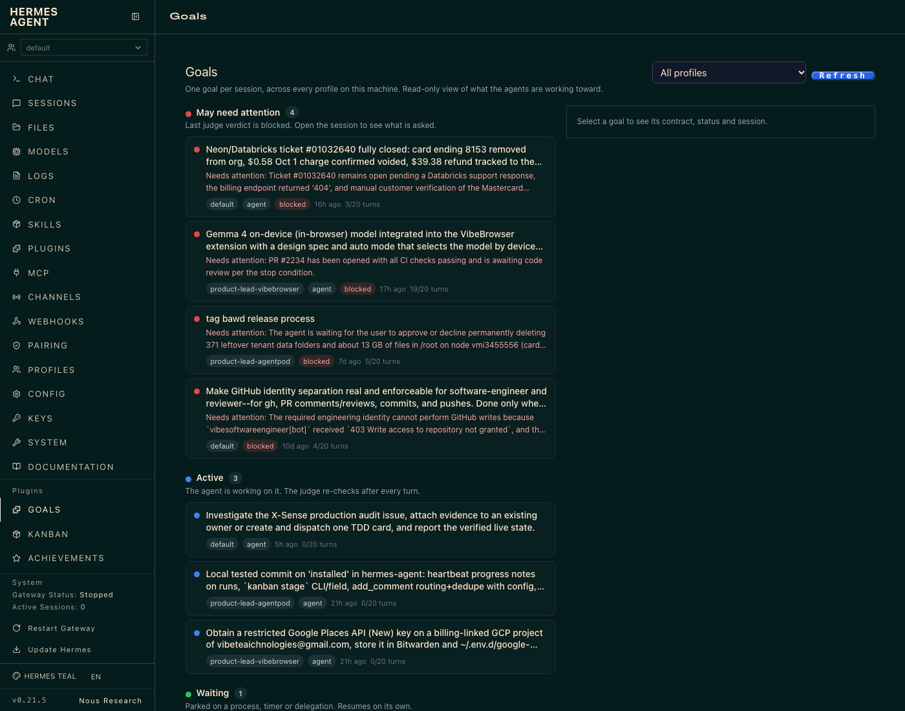
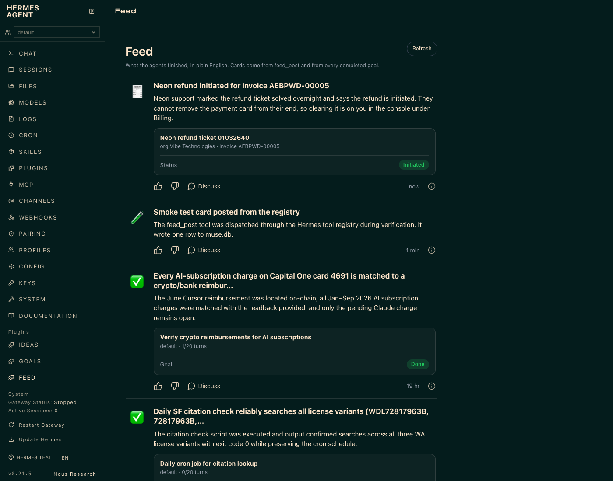
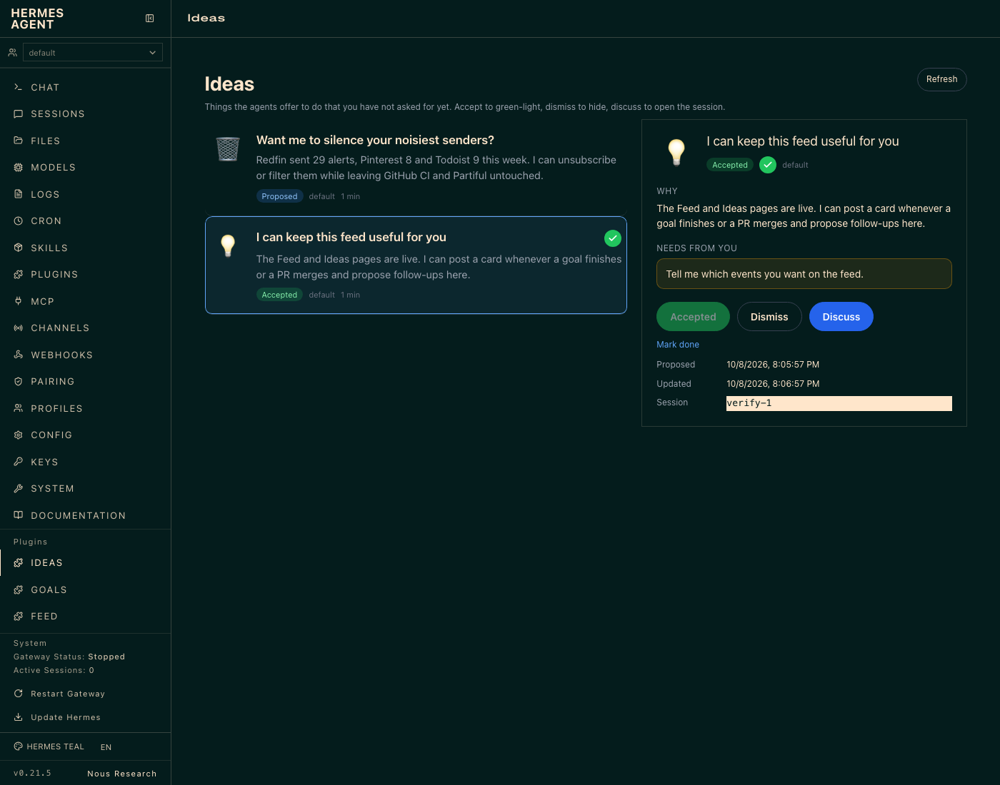

# hermes-plugins — Goals, Feed and Ideas for Hermes Agent

Three dashboard plugins that give a team of Hermes agents the same three surfaces Meta's Muse assistant has: **Goals** (what each agent is driving toward), **Feed** (what finished), **Ideas** (what agents offer to do next).

## TL;DR

**Problem.** Once you run more than a couple of Hermes agents (product leads, engineers, reviewer, support…), you lose the picture. Each session has a goal and a heartbeat, but they live inside that session's SQLite row. There is no single place to see: which goals are stuck and why, what actually got done today, and what the agents would do next if you let them. You end up asking each agent "status?" by hand — which is exactly the thing an agent team is supposed to remove.

**Solution.** Three small, read-mostly plugins on top of the data Hermes already keeps, plus five tools so agents can write to and read from the shared surfaces:

- **Goals** — one page listing every goal across every profile, grouped by what the judge last said (`blocked`, active, waiting, paused, done). Read-only over Hermes' own `state_meta goal:<session>` rows. No new state.
- **Feed** — a timeline of cards agents post when something finished (PR merged, refund landed, decision needed), merged with every goal the judge marked done. You react with thumbs up/down; agents can read those reactions.
- **Ideas** — first-person offers ("I can keep Buster's care on schedule…") that agents propose without being asked. You accept or dismiss; the agent that proposed it can see the decision and mark it done.

Everything is local: SQLite files under `~/.hermes`, a FastAPI router mounted by the dashboard, a vanilla-JS tab using the dashboard plugin SDK. No gateway changes, no schema migration, no cloud.

**Where this came from.** We checked upstream Hermes (`NousResearch/hermes-agent`) and OpenClaw: Hermes has a per-session goal indicator in the desktop app and 15 open goal-related PRs, none of which adds a cross-session view; OpenClaw has heartbeats but no goals UI. The UX is copied from Muse's Goals / Feed / Ideas tabs (screenshots in the design doc). Design doc and the gpt-6-astra critique that shaped v1: see [References](#references).

## Screenshots

| Goals | Feed | Ideas |
|---|---|---|
|  |  |  |

## How it fits into Hermes

```
                    ┌──────────────────────── Hermes dashboard (:9119) ───────────────────────┐
                    │  sidebar → Plugins → Goals | Feed | Ideas                                │
                    │  dist/index.js (SDK React) ──fetchJSON──► /api/plugins/<name>/…           │
                    └───────────────────────────────┬──────────────────────────────────────────┘
                                                    │ FastAPI router from dashboard/plugin_api.py
            ┌───────────────────────────────────────┼─────────────────────────────────────────┐
            │ goals-page                             │ feed-page / ideas-page                   │
            │ read-only                              │ read + small writes                      │
            ▼                                        ▼                                           │
 ~/.hermes/state.db            ~/.hermes/profiles/<p>/state.db          ~/.hermes/muse.db       │
 state_meta goal:<sid>  …      state_meta goal:<sid>                    feed_items, ideas,       │
 (written by Hermes'           (one DB per profile)                     reactions               │
  goal loop / judge)                                                    (written by the tools)  │
            ▲                                        ▲                       ▲                   │
            │                                        │                       │                   │
   hermes goal loop + judge                 any agent, any profile ── feed_post / idea_propose   │
   (unchanged)                                                        feed_read / ideas_read     │
                                                                      idea_update                │
```

Key choices:

- **One shared `muse.db` at `~/.hermes/muse.db`, not under `HERMES_HOME`.** Profiles each have their own `HERMES_HOME`; the Feed and Ideas are meant to be shared across them, so the store is keyed off the real home directory. Each row records `profile` and `session_id` so you can still see who said what and jump back into that chat.
- **Goals adds no state.** It reads the rows Hermes already writes and shows them. If Hermes changes its goal schema, only the reader changes.
- **SQLite opened read-only / WAL / `busy_timeout`.** Agents are writing to those DBs while you look at the page. Readers must never block a writer, and a locked DB must show up as an `errors[]` entry for that profile, not a blank page.
- **Dashboard-only plugins.** No agent hooks, no context injection. The only agent-facing surface is the five tools, which are plain functions over the store.

## Flows

### Goal lifecycle → Goals page → Feed

```
agent turn ──► goal(create objective, acceptance_criteria)
                    │
                    ▼
        Hermes goal loop + judge (per session)      ← unchanged core
          status: active | paused | done | cleared
          last_verdict: continue | blocked | done
                    │  writes state_meta goal:<sid>
                    ▼
   goals-page GET /goals ── groups by truth, not guesses:
     "May need attention"  = last_verdict == blocked (judge's reason shown as evidence)
     Active / Waiting / Paused / Done
     cleared ≠ done (shown as cleared)
                    │
                    └─ status == done ──► feed-page merges a synthetic card
                                           (title = goal, body = judge's last reason)
```

### Feed card

```
agent finishes something
   │ feed_post(title, body, icon?, link_title?, link_subtitle?, link_status?, link_url?)
   ▼
feed_items row (profile, session_id, created_at)
   │
   ▼  GET /feed  (tool rows ∪ done-goal cards, newest first)
Feed page card: icon · title · body · [link card + status pill] · 👍 👎 Discuss · "10 hr"
   │ 👍/👎 ──► POST /feed/{id}/reaction  (also works for goal-derived ids)
   │ Discuss ──► /chat?resume=<session_id>   (opens the chat that posted it)
   └ other agents ──► feed_read(query, profile, limit) sees cards + your reactions
```

### Idea lifecycle

```
agent notices an opportunity
   │ ideas_read()  — is it already proposed?
   │ idea_propose(title "I can …", body, needs_from_user, icon?)
   │   dedupe: same title + status proposed → update, don't duplicate
   ▼
ideas row  status = proposed
   │
   ▼  Ideas page: card, no inline buttons (tap → detail)
you: Accept ──► status accepted (green check)      Dismiss ──► dismissed
   │
   └ proposing agent ──► ideas_read(status="accepted") → does the work
                     ──► idea_update(id, "done")   (agents cannot set "accepted")
```

## Agent tools (toolset `muse`)

| Tool | Who calls it | What it does |
|---|---|---|
| `feed_post(title, body, …)` | any agent | Post a past-tense, 2–4 sentence card about something that finished. |
| `feed_read(limit?, profile?, query?)` | any agent | Read recent cards + done goals, including the user's thumbs. |
| `idea_propose(title, body, needs_from_user, icon?)` | any agent | Offer something the user has not asked for. Deduped by title while `proposed`. |
| `ideas_read(status?, profile?, query?)` | any agent | See what's proposed/accepted/dismissed/done. |
| `idea_update(id, status)` | proposing agent | `done` or `dismissed`. `accepted` is refused — only the user accepts. |

## HTTP API (mounted by the dashboard)

```
GET  /api/plugins/goals-page/goals            → {goals:[…], profiles:[…], errors:[…]}
GET  /api/plugins/feed-page/feed?limit=100    → {items:[…], errors:[…]}
POST /api/plugins/feed-page/feed/{id}/reaction  {reaction: "up"|"down"|null}
GET  /api/plugins/ideas-page/ideas            → {items:[…], errors:[…]}
POST /api/plugins/ideas-page/ideas/{id}/status  {status: "accepted"|"dismissed"|"done"|"proposed"}
```

Auth is the dashboard's own loopback session token (`X-Hermes-Session-Token`), same as every other dashboard call.

## Install

```bash
git clone https://github.com/dzianisv/hermes-plugins ~/workspace/hermes-plugins
for p in goals-page feed-page ideas-page; do
  ln -sfn ~/workspace/hermes-plugins/plugins/$p ~/.hermes/plugins/$p
done
```

Then in `~/.hermes/config.yaml` (and in each profile's `config.yaml` whose agents should get the tools):

```yaml
plugins:
  enabled:
    - goals-page
    - feed-page
    - ideas-page
```

Restart the dashboard (`hermes dashboard`). Gateways pick up the tools on their next restart. The three plugins can be installed independently; Feed degrades gracefully (reports in `errors[]`) if Goals is absent, and Ideas needs Feed for its store.

## Repo layout

```
plugins/
  goals-page/   plugin.yaml, __init__.py (no-op), dashboard/{manifest.json, plugin_api.py, dist/index.js, dist/style.css}, tests/
  feed-page/    __init__.py registers the 5 tools; dashboard/muse_store.py is the shared store; tests/
  ideas-page/   dashboard/plugin_api.py imports the store from feed-page
docs/img/       screenshots
```

## Tests

```bash
~/.hermes/hermes-agent/venv/bin/python -m pytest plugins -q
```

What they check, all against real-shaped rows copied from a live `state.db` (no invented goals):

- `cleared` is not `done`; a resumed goal supersedes an older `blocked` verdict.
- A profile whose DB is locked or missing shows in `errors[]`; the other profiles still render.
- Reads succeed while another connection holds `BEGIN IMMEDIATE` and keeps writing.
- Tool handlers write rows; idea dedupe; reaction toggle; status ordering; agents cannot `accept`.
- Done goals are merged into the feed and reactions on them persist.

## Design notes and non-goals

- v1 is deliberately read-mostly. No creating or editing goals from the page; that stays with `/goal` and the `goal` tool.
- There is no per-goal activity history yet because Hermes overwrites `GoalState` in place. The page shows the latest judge verdict and reason. A `goal_events` table upstream would unlock Muse's dated Activity list.
- Three plugin directories rather than one because a Hermes dashboard manifest currently declares one tab. A multi-tab manifest upstream would let these merge into a single `muse` plugin.
- Desktop (Electron) pane not built; the dashboard web tab is what exists today.

## References

- Design doc (Notion): https://app.notion.com/p/3f3ac25eb49f81028008ec3a19e80edf — problem, data model, open questions, and the gpt-6-astra critique with the decisions it drove (no inferred Tracking/Goals split, `cleared ≠ done`, attention flag only on a real `blocked` verdict, no fabricated history).
- Parent doc "Goal and Heartbeat" (Notion): https://app.notion.com/p/Goal-and-Heartbeat-3f2ac25eb49f80a6a4adcf2a1d91e498 — how goals and heartbeats are supervised across the agent team; field notes on supervisor misreads this UI is meant to prevent.
- Upstream goal tool PR: https://github.com/NousResearch/hermes-agent/pull/134448 — `goal(create/get/complete)` with acceptance criteria; the rows this UI reads.
- Hermes dashboard plugin SDK: `website/docs/developer-guide/desktop-plugin-sdk.md` and `plugins/hermes-achievements/dashboard/` in `NousResearch/hermes-agent` (the manifest/API pattern copied here).
- Prior-art check (2026-10-08): `NousResearch/hermes-agent` — `apps/desktop/src/store/goals.ts` (per-session indicator only), 15 open goal PRs, none cross-session; OpenClaw — heartbeat, no goals UI.
- UX reference: Meta Muse app, Goals / Feed / Ideas tabs.

## License

MIT
